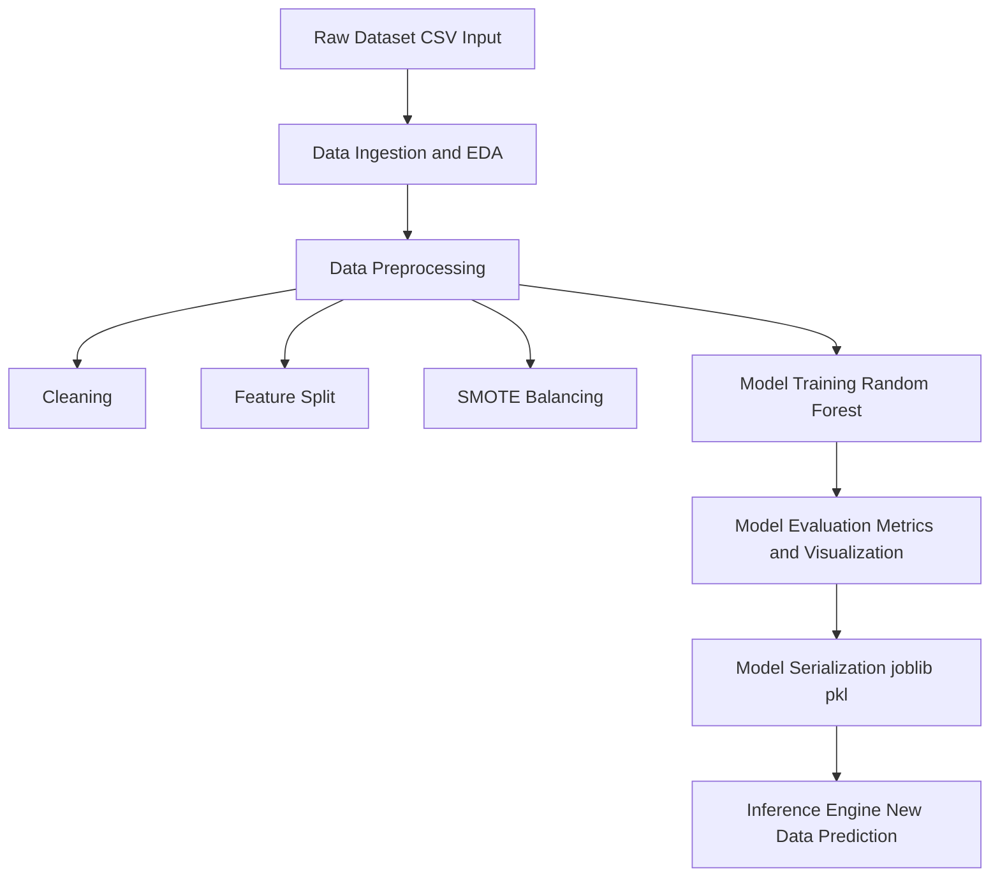
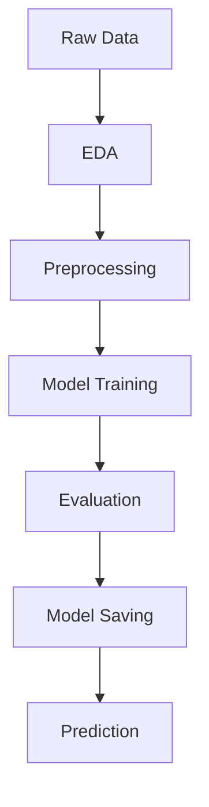

<div align="center">

# 🏦 Advanced Deep Learning for Real-Time Fraud Detection in Banking

### 🔐 Revolutionizing Financial Security with AI

**TTEH LAB · School of Engineering, Dayananda Sagar University**  
*Bangalore – 562112, Karnataka, India*

<br/>


<br/><br/>

### 📌 Prototype Implementation of:

**"Advanced Deep Learning for Real-Time Fraud Detection in Banking"**

<br/>

### 📄 ICICI-2025, IEEE Xplore  
**DOI:** https://doi.org/10.1109/INCET64471.2025.11139964

</div>
</div>

---

<br/><br/><br/><br/><br/><br/>

<div align="left">

## 🔭 Overview

The rapid growth of digital banking has increased the risk of sophisticated financial fraud, making traditional rule-based systems less effective in handling high-volume, real-time transactions.  

This project proposes an **advanced deep learning framework for real-time fraud detection**, designed to identify suspicious activities with high accuracy and low latency. It combines **Apache Kafka for real-time data streaming**, **feature engineering**, and powerful models such as **RNNs / Transformers**, **Graph Neural Networks (GNNs)**, and **Autoencoders / Isolation Forests** for anomaly detection.  

The system is deployed on scalable cloud platforms (**AWS / Azure / GCP**) with strong **MLOps practices** for continuous monitoring and improvement.  

Overall, the solution aims to achieve **high detection accuracy**, **low false positives**, and **real-time fraud prevention**, enhancing security and customer trust in banking systems.

<br/>

`Real-Time Fraud Detection` · `Deep Learning` · `GNN` · `Transformers` · `Anomaly Detection` · `Kafka` · `Cloud` · `MLOps`

</div>
</div>

---

<br/><br/><br/><br/><br/><br/>

<div align="left">

## 📚 Table of Contents

1. **Introduction**  
2. **Methodology & Key Components**  
3. **Data Exploration & Preprocessing**  
4. **Model Development**  
5. **Model Evaluation**  
6. **Deployment Strategy**  
7. **Future Work & Enhancements**  
8. **Conclusion**  

<br/>

</div>
</div>

---

<br/><br/><br/><br/><br/><br/>

<div align="left">

## 1. Introduction

### Problem Statement
The banking industry faces increasingly sophisticated fraud, causing significant financial losses and reducing customer trust. Traditional rule-based and statistical systems are often reactive, struggle to adapt to evolving fraud patterns, and generate high false positives, disrupting legitimate transactions. The scale and speed of modern financial data demand a more intelligent, real-time fraud detection approach.

### Project Goal
The goal of this project is to develop an **advanced deep learning framework for real-time fraud detection** that improves accuracy and efficiency using modern AI techniques. The system aims to:

- **Minimize Financial Losses** through precise fraud detection  
- **Improve Detection Speed** with real-time analysis  
- **Reduce False Positives** to avoid disrupting genuine users  
- **Enhance Adaptability** to evolving fraud patterns  
- **Leverage Advanced Models** such as RNNs/Transformers, GNNs, and anomaly detection techniques  

<br/>

`Fraud Detection` · `Deep Learning` · `Real-Time Systems` · `Banking Security` · `AI Models`

</div>
</div>

---

<br/><br/><br/><br/><br/><br/>

<div align="left">

## 2. Methodology & Key Components

This project uses an advanced deep learning–based methodology combined with scalable infrastructure to enable real-time fraud detection. The system is designed to handle high-volume transaction data, detect complex fraud patterns, and ensure efficient performance.

- **Real-Time Data Ingestion** using technologies like Apache Kafka for continuous transaction streaming  
- **Feature Engineering** to transform raw data into meaningful behavioral, contextual, and relational features  
- **Deep Learning Models** including RNNs/Transformers, Graph Neural Networks (GNNs), and anomaly detection techniques  
- **Hybrid Models** combining deep learning with rule-based systems for improved accuracy  
- **Scalable Infrastructure** using cloud platforms (AWS / Azure / GCP) with distributed computing  
- **MLOps & Monitoring** for continuous training, deployment, and performance tracking  

<br/>

`Kafka` · `Feature Engineering` · `Deep Learning` · `GNN` · `Hybrid Models` · `Cloud` · `MLOps`

</div>
</div>

---

<br/><br/><br/><br/><br/><br/>

<div align="left">

## 3. Data Exploration & Preprocessing

### **Initial Data Inspection**
- Understand data structure, types, and initial patterns  
- Identify data quality issues and potential anomalies  

### **Handling Missing Values**
- Strategies for imputation or removal based on data context  
- Minimizing data loss while ensuring data integrity  

### **Data Cleaning and Transformation**
- Standardize formats and address inconsistencies  
- Feature scaling, encoding categorical variables, and preparing data for model input  

<br/>

`Data Inspection` · `Missing Values` · `Data Cleaning` · `Transformation` · `Preprocessing`

</div>
</div>

---

<br/><br/><br/><br/><br/><br/>

<div align="left">

## 4. Model Development

### **Feature Selection**
- Identify and select the most relevant features for fraud detection  
- Reduce dimensionality and noise in the dataset  

### **Architecture Design**
- Design and implement deep learning models:  
  - **RNNs/Transformers** for sequential transaction data  
  - **GNNs** for relational analysis of entities  
  - **Autoencoders** for anomaly detection  

### **Model Training and Validation**
- Train models on historical data with appropriate loss functions  
- Validate performance using unseen data to prevent overfitting  

### **Hyperparameter Tuning**
- Optimize model parameters (e.g., learning rate, network size) for peak performance  

<br/>

`Feature Selection` · `Model Design` · `Deep Learning` · `Training` · `Hyperparameter Tuning`

</div>
</div>

---

<br/><br/><br/><br/><br/><br/>

<div align="left">

## 6. Deployment Strategy (Conceptual)

### **Real-Time Inference Considerations**
- Low-latency model serving (e.g., using TensorFlow Serving or custom APIs)  
- Integration with fraud detection systems via microservices architecture  

### **Integration with Banking Systems**
- Seamless data flow from transaction processing systems  
- Automated alert generation for suspicious activities  
- Feedback loops for continuous model improvement with analyst input  

<br/>

`Deployment` · `Real-Time Inference` · `Microservices` · `Banking Integration` · `MLOps`

</div>

</div>

---

<br/><br/><br/><br/><br/><br/>

<div align="left">

## 7. Future Work & Enhancements

### **Adaptive Learning Mechanisms**
- Implement systems that continuously learn and adapt to new fraud patterns  

### **Explainable AI (XAI) for Fraud Detection**
- Integrate XAI techniques to provide transparent insights into fraud detection decisions  

### **Exploring Novel Deep Learning Architectures**
- Investigate and adopt advanced deep learning models to enhance detection capabilities  

<br/>

`Adaptive Learning` · `Explainable AI` · `Deep Learning` · `Innovation` · `Fraud Detection`

</div>
</div>

---

<br/><br/><br/><br/><br/><br/>

<div align="left">

## 8. Conclusion

### **Summary of Findings**
- Initial rule-based classification labeled 98.7% profiles as 'Fake' and only 1.3% as 'Real'  
- Indicates overly strict rules, likely misclassifying incomplete profiles rather than detecting true fraud  

### **Impact and Significance**
- High false-positive rate highlights need for significant refinement  
- Direct deployment may negatively impact user experience  
- Emphasizes importance of balanced rules and proper thresholds  

### **Next Steps**
- Refine rule set and improve feature engineering  
- Explore machine learning approaches for better accuracy  
- Develop a balanced model to correctly distinguish fake and legitimate profiles  

<br/>

`Conclusion` · `Findings` · `Model Improvement` · `Fraud Detection` · `Future Scope`

</div>

# 🔐 Advanced Deep Learning for Real-Time Fraud Detection in Banking

<p align="center">


</p>

---

## 🎬 Demo

### 🔹 Fraud Detection in Action (GIF)


👉 This demo shows:
- Real-time transaction processing  
- Fraud prediction output  
- Model confidence score  

---

## 📌 System Architecture


## ⚙️ Methodology Overview
## 🧠 Methodology Overview

This project follows a structured machine learning pipeline to convert raw data into accurate predictions.

---

### 1️⃣ Data Collection
- Dataset is collected in CSV format  
- Serves as the input for the pipeline  

---

### 2️⃣ Data Ingestion & EDA
- Load dataset using pandas  
- Analyze missing values and structure  
- Visualize patterns using graphs  

---

### 3️⃣ Data Preprocessing

#### 🔹 Data Cleaning
- Handle missing values  
- Remove duplicates  
- Fix inconsistent data  

#### 🔹 Feature Engineering
- Split features and target  
- Encode categorical variables  

#### 🔹 Data Balancing
- Apply SMOTE technique  
- Handle class imbalance  

---

### 4️⃣ Model Training
- Train using Random Forest Classifier  
- Learn patterns from data  

---

### 5️⃣ Model Evaluation

Evaluate using:

- Accuracy  
- Precision  
- Recall  
- F1-score  

#### 📐 Formulas

**Accuracy**
```
Accuracy = (TP + TN) / (TP + TN + FP + FN)
```

**Precision**
```
Precision = TP / (TP + FP)
```

**Recall**
```
Recall = TP / (TP + FN)
```

---

### 6️⃣ Model Serialization
- Save model using joblib  
- Export as `.pkl` file  

---

### 7️⃣ Inference Engine
- Load saved model  
- Predict on new data  

---

## 🔄 Workflow Diagram



---

## 🚀 Outcome
- Clean data pipeline  
- Balanced dataset  
- Accurate predictions  
- Ready for deployment  

---

## 🧹 Data Preprocessing


### 📊 Formula Table

| Concept | Formula | Description |
|--------|--------|------------|
| Normalization | x' = (x - xmin) / (xmax - xmin) | Feature scaling |
| SMOTE | Synthetic sampling | Balance dataset |

---

## 🔗 Graph-Based Transaction Representation


### 📊 Formula Table

| Concept | Formula |
|--------|--------|
| Graph | G = (V, E) |
| Adjacency Matrix | Aij = 1 (if edge exists), else 0 |

---

## 🧠 Graph Neural Network (GNN)


### 📊 Formula Table

| Concept | Formula |
|--------|--------|
| GNN Layer | H(l+1) = σ(D⁻¹/² A D⁻¹/² H(l) W(l)) |

---

## 🤖 Transformer-Based Fraud Detection


### 📊 Formula Table

| Concept | Formula |
|--------|--------|
| Attention | softmax(QKᵀ / √dk) V |

---

## ⚔️ Adversarial Training


### 📊 Formula Table

| Concept | Formula |
|--------|--------|
| Adversarial Example | x' = x + ε sign(∇L(x,y)) |

---

## 📉 Loss Function

| Type | Formula |
|------|--------|
| Total Loss | L = LCE + λ1Lgraph + λ2Ladv |

---

## 📈 Evaluation Metrics

| Metric | Formula |
|--------|--------|
| Precision | TP / (TP + FP) |
| Recall | TP / (TP + FN) |
| F1 Score | 2PR / (P + R) |
| AUC-ROC | ∫ TPR dFPR |

---

## 🏆 Results

| Metric | Value |
|-------|------|
| F1 Score | **98.3%** |
| AUC-ROC | **99.1%** |
| Robustness | **89.7%** |
| Latency | **7.2 ms** |

---

## 🎯 Key Contributions

✔ Hybrid GNN + Transformer model  
✔ Adversarial robustness  
✔ Real-time fraud detection  
✔ High accuracy & scalability  

---

## 🧪 Tech Stack

- Python  
- TensorFlow / PyTorch  
- Scikit-learn  
- NetworkX  

---

## 📂 Project Structure
## 👥 Contributors

<table>
<tr>
<td align="center">
<b>Pragna.G</b><br>
ENG23CY0031<br>
<a href="mailto:pragna122004@gmail.com">pragna122004@gmail.com</a>
</td>

<td align="center">
<b>Harshitha.B.R</b><br>
ENG23CY0018<br>
<a href="mailto:harshisuma1805@gmail.com">harshisuma1805@gmail.com</a>
</td>

<td align="center">
<b>Akshata</b><br>
ENG23CY0003<br>
<a href="mailto:tattiakshata@gmail.com">tattiakshata@gmail.com</a>
</td>

<td align="center">
<b>Sunay</b><br>
ENG23CY0016<br>
<a href="mailto:Rajsunay1@gmail.com">Rajsunay1@gmail.com</a>
</td>

<td align="center">
<b>Druthu</b><br>
ENG23CY0014<br>
<a href="mailto:druthukatna51@gmail.com">druthukatna51@gmail.com</a>
</td>
</tr>
</table>

---

### 🏫 Department  
**Department of Computer Science and Engineering (Cyber Security)**  
School of Engineering, Dayananda Sagar University  

---

## 🧑‍🏫 Mentor

**Dr. Prajwalasimha S N**  
_Ph.D., Postdoc. (NewRIIS)_  
Associate Professor  

Department of Computer Science and Engineering (Cyber Security)  
School of Engineering, Dayananda Sagar University  

---

## 🔬 Laboratory

**TTEH LAB**  
School of Engineering  
Dayananda Sagar University  

📍 Bangalore – 562112, Karnataka, India  

---

## 📄 IEEE Paper

**DOI:** https://doi.org/10.1109/INCET64471.2025.11139964

