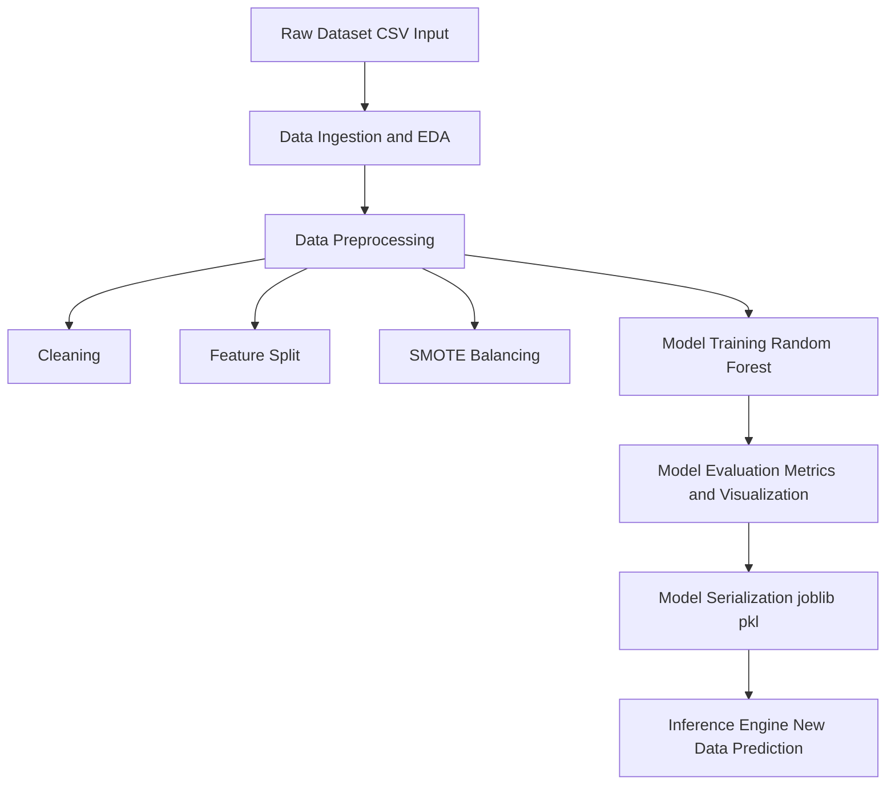

# 🏦 Advanced Deep Learning for Real-Time Fraud Detection in Banking

### 🔐 Revolutionizing Financial Security with AI

**TTEH LAB · School of Engineering, Dayananda Sagar University**  
*Bangalore – 562112, Karnataka, India*

 

  

### 📌 Prototype Implementation of:

**"Advanced Deep Learning for Real-Time Fraud Detection in Banking"**

 

### 📄 ICICI-2025, IEEE Xplore  
**DOI:** https://doi.org/10.1109/INCET64471.2025.11139964

---

      

## 🔭 Overview

The rapid growth of digital banking has increased the risk of sophisticated financial fraud, making traditional rule-based systems less effective in handling high-volume, real-time transactions.  

This project proposes an **advanced deep learning framework for real-time fraud detection**, designed to identify suspicious activities with high accuracy and low latency. It combines **Apache Kafka for real-time data streaming**, **feature engineering**, and powerful models such as **RNNs / Transformers**, **Graph Neural Networks (GNNs)**, and **Autoencoders / Isolation Forests** for anomaly detection.  

The system is deployed on scalable cloud platforms (**AWS / Azure / GCP**) with strong **MLOps practices** for continuous monitoring and improvement.  

Overall, the solution aims to achieve **high detection accuracy**, **low false positives**, and **real-time fraud prevention**, enhancing security and customer trust in banking systems.

 

`Real-Time Fraud Detection` · `Deep Learning` · `GNN` · `Transformers` · `Anomaly Detection` · `Kafka` · `Cloud` · `MLOps`

---

      

## 📚 Table of Contents

1. **Introduction**  
2. **Methodology & Key Components**  
3. **Data Exploration & Preprocessing**  
4. **Model Development**  
5. **Model Evaluation**  
6. **Deployment Strategy**  
7. **Future Work & Enhancements**  
8. **Conclusion**  

 

---

      

## 1. Introduction

### Problem Statement
The banking industry faces increasingly sophisticated fraud, causing significant financial losses and reducing customer trust. Traditional rule-based and statistical systems are often reactive, struggle to adapt to evolving fraud patterns, and generate high false positives, disrupting legitimate transactions. The scale and speed of modern financial data demand a more intelligent, real-time fraud detection approach.

### Project Goal
The goal of this project is to develop an **advanced deep learning framework for real-time fraud detection** that improves accuracy and efficiency using modern AI techniques. The system aims to:

- **Minimize Financial Losses** through precise fraud detection  
- **Improve Detection Speed** with real-time analysis  
- **Reduce False Positives** to avoid disrupting genuine users  
- **Enhance Adaptability** to evolving fraud patterns  
- **Leverage Advanced Models** such as RNNs/Transformers, GNNs, and anomaly detection techniques  

 

`Fraud Detection` · `Deep Learning` · `Real-Time Systems` · `Banking Security` · `AI Models`

---

      

## 2. Methodology & Key Components

This project uses an advanced deep learning–based methodology combined with scalable infrastructure to enable real-time fraud detection. The system is designed to handle high-volume transaction data, detect complex fraud patterns, and ensure efficient performance.

- **Real-Time Data Ingestion** using technologies like Apache Kafka for continuous transaction streaming  
- **Feature Engineering** to transform raw data into meaningful behavioral, contextual, and relational features  
- **Deep Learning Models** including RNNs/Transformers, Graph Neural Networks (GNNs), and anomaly detection techniques  
- **Hybrid Models** combining deep learning with rule-based systems for improved accuracy  
- **Scalable Infrastructure** using cloud platforms (AWS / Azure / GCP) with distributed computing  
- **MLOps & Monitoring** for continuous training, deployment, and performance tracking  

 

`Kafka` · `Feature Engineering` · `Deep Learning` · `GNN` · `Hybrid Models` · `Cloud` · `MLOps`

---

      

## 3. Data Exploration & Preprocessing

### **Initial Data Inspection**
- Understand data structure, types, and initial patterns  
- Identify data quality issues and potential anomalies  

### **Handling Missing Values**
- Strategies for imputation or removal based on data context  
- Minimizing data loss while ensuring data integrity  

### **Data Cleaning and Transformation**
- Standardize formats and address inconsistencies  
- Feature scaling, encoding categorical variables, and preparing data for model input  

 

`Data Inspection` · `Missing Values` · `Data Cleaning` · `Transformation` · `Preprocessing`

---

      

## 4. Model Development

### **Feature Selection**
- Identify and select the most relevant features for fraud detection  
- Reduce dimensionality and noise in the dataset  

### **Architecture Design**
- Design and implement deep learning models:  
  - **RNNs/Transformers** for sequential transaction data  
  - **GNNs** for relational analysis of entities  
  - **Autoencoders** for anomaly detection  

### **Model Training and Validation**
- Train models on historical data with appropriate loss functions  
- Validate performance using unseen data to prevent overfitting  

### **Hyperparameter Tuning**
- Optimize model parameters (e.g., learning rate, network size) for peak performance  

 

`Feature Selection` · `Model Design` · `Deep Learning` · `Training` · `Hyperparameter Tuning`

---

      

## 6. Deployment Strategy (Conceptual)

### **Real-Time Inference Considerations**
- Low-latency model serving (e.g., using TensorFlow Serving or custom APIs)  
- Integration with fraud detection systems via microservices architecture  

### **Integration with Banking Systems**
- Seamless data flow from transaction processing systems  
- Automated alert generation for suspicious activities  
- Feedback loops for continuous model improvement with analyst input  

 

`Deployment` · `Real-Time Inference` · `Microservices` · `Banking Integration` · `MLOps`

---

      

## 7. Future Work & Enhancements

### **Adaptive Learning Mechanisms**
- Implement systems that continuously learn and adapt to new fraud patterns  

### **Explainable AI (XAI) for Fraud Detection**
- Integrate XAI techniques to provide transparent insights into fraud detection decisions  

### **Exploring Novel Deep Learning Architectures**
- Investigate and adopt advanced deep learning models to enhance detection capabilities  

 

`Adaptive Learning` · `Explainable AI` · `Deep Learning` · `Innovation` · `Fraud Detection`

---

      

## 📌 System Architecture

## 🤖 Model Design

- Hybrid deep learning architecture combining  
  **Graph Neural Networks (GNN)** + **Transformer Models**

- **GNN Layer**
  - Captures relationships between entities (graph-structured data)
  - Learns connectivity patterns and hidden dependencies

- **Transformer Layer**
  - Processes sequential data (logs / events)
  - Captures long-range dependencies using attention mechanism

- **Feature Fusion**
  - Outputs from GNN and Transformer are combined
  - Creates a richer, context-aware representation

- **Adversarial Training**
  - Introduces perturbed inputs during training
  - Improves robustness against attacks and noise

- **Output Layer**
  - Classification / prediction (e.g., anomaly detection)

---

### 🔄 Workflow
**Input Data → Preprocessing → GNN → Transformer → Fusion → Prediction**

---
## 🧪 Tech Stack

| Layer                | Technologies                          |
|---------------------|--------------------------------------|
| Language            | Python                               |
| Data Processing     | Pandas, NumPy                        |
| Imbalance Handling  | SMOTE                                |
| ML Models           | GNN, Transformers                    |
| Frameworks          | PyTorch / TensorFlow                 |
| Security            | Zero Trust Architecture              |
| Visualization       | Matplotlib, Seaborn                  |
| Tools               | Jupyter, GitHub                      |

- Built using **Python**, enabling seamless integration of data processing, machine learning, and deep learning components.  
- Efficient data handling achieved with **Pandas** and **NumPy** for preprocessing and transformation.  
- Addressed class imbalance using **SMOTE**, improving model fairness and performance.  
- Leveraged **Graph Neural Networks (GNN)** and **Transformer models** for capturing complex relationships and sequential patterns.  
- Implemented using powerful frameworks like **PyTorch / TensorFlow** for scalable deep learning.  
- Designed with a **Zero Trust Architecture**, enhancing system security and resilience.  
- Data insights and results visualized using **Matplotlib** and **Seaborn**.  
- Developed and managed using **Jupyter Notebook / Google Colab** and version-controlled via **GitHub**.
---

## 📊 Results & Analysis

| Metric / Finding | Value / Result | Analysis & Implications |
| :--- | :--- | :--- |
| **Initial Class Distribution** | **Legitimate (0):** 150,337 **Fraudulent (1):** 294 | 🚨 **Severe Imbalance:** The dataset is highly skewed, causing models to favor the majority class and overlook fraud cases. |
| **Overall Accuracy** | **99.95%** | ⚠️ **Accuracy Paradox:** Despite being high, accuracy is misleading due to imbalance. Even a naive model could achieve similar results. |
| **Precision (Fraud Class)** | **0.96 (96%)** | ✅ **High Confidence:** Fraud predictions are highly reliable, minimizing inconvenience to legitimate users. |
| **Recall (Fraud Class)** | **0.80 (80%)** | ❗ **Critical Weakness:** 20% of fraud cases are missed, leading to potential financial losses. |
| **F1-Score (Fraud Class)** | **0.87 (87%)** | ⚖️ **Balanced Performance:** Indicates decent trade-off, but affected by lower recall. |
| **ROC-AUC Score** | **~0.898** | 📈 **Strong Discrimination:** Good ability to distinguish classes, but not optimal for high-security systems. |
| **Confusion Matrix Breakdown** | **TN:** 30,061 **FP:** 2 **FN:** 13 **TP:** 51 | 🔍 **Conservative Model Behavior:** Minimizes false alarms but allows some fraud cases to go undetected. |
| **Pipeline Optimization Applied** | **SMOTE Integration** | 🔧 **Improvement Strategy:** Balances dataset by generating synthetic fraud samples, enhancing recall and detection capability. |

---

### 🔍 Key Takeaways
- Model prioritizes **precision over recall**, ensuring fewer false alerts  
- **Class imbalance** significantly impacts performance metrics  
- **SMOTE improves minority class detection**, but further tuning is needed  
- Trade-off exists between **security (recall)** and **user experience (precision)** 

## 8. Conclusion

### **Summary of Findings**
- The hybrid model combining **GNN and Transformer architectures** achieved high overall accuracy (~99.95%)  
- Strong **precision (96%)** indicates reliable fraud detection with minimal false alarms  
- However, **recall (80%)** reveals that some fraud cases remain undetected  
- Severe class imbalance significantly influenced model behavior and evaluation metrics  

### **Impact and Significance**
- The model is effective in **minimizing false positives**, ensuring better user experience  
- Missed fraud cases highlight a **critical risk in real-world financial systems**  
- Demonstrates the importance of using **appropriate metrics (Precision, Recall, F1)** instead of relying solely on accuracy  
- Integration of **SMOTE and adversarial training** improves robustness and fairness  

### **Next Steps**
- Improve **recall** through hyperparameter tuning and advanced sampling techniques  
- Experiment with **ensemble or more advanced deep learning models**  
- Optimize the system for **real-time deployment and scalability**  
- Further strengthen the **security layer with advanced zero-trust and quantum-resilient mechanisms**  

## 📂 Project Structure
## 👥 Contributors

<table>
<tr>
<td align="center">
<b>Pragna.G</b> 
ENG23CY0031 
<a href="mailto:pragna122004@gmail.com">pragna122004@gmail.com</a>
</td>

<td align="center">
<b>Harshitha.B.R</b> 
ENG23CY0018 
<a href="mailto:harshisuma1805@gmail.com">harshisuma1805@gmail.com</a>
</td>

<td align="center">
<b>Akshata</b> 
ENG23CY0003 
<a href="mailto:tattiakshata@gmail.com">tattiakshata@gmail.com</a>
</td>

<td align="center">
<b>Sunay</b> 
ENG23CY0016 
<a href="mailto:Rajsunay1@gmail.com">Rajsunay1@gmail.com</a>
</td>

<td align="center">
<b>Druthu</b> 
ENG23CY0014 
<a href="mailto:druthukatna51@gmail.com">druthukatna51@gmail.com</a>
</td>
</tr>
</table>

---

### 🏫 Department  
**Department of Computer Science and Engineering (Cyber Security)**  
School of Engineering, Dayananda Sagar University  

---

## 🧑‍🏫 Mentor

**Dr. Prajwalasimha S N**  
_Ph.D., Postdoc. (NewRIIS)_  
Associate Professor  

Department of Computer Science and Engineering (Cyber Security)  
School of Engineering, Dayananda Sagar University  

---

## 🔬 Laboratory

**TTEH LAB**  
School of Engineering  
Dayananda Sagar University  

📍 Bangalore – 562112, Karnataka, India  

---

## 📄 IEEE Paper

**DOI:** https://doi.org/10.1109/INCET64471.2025.11139964

