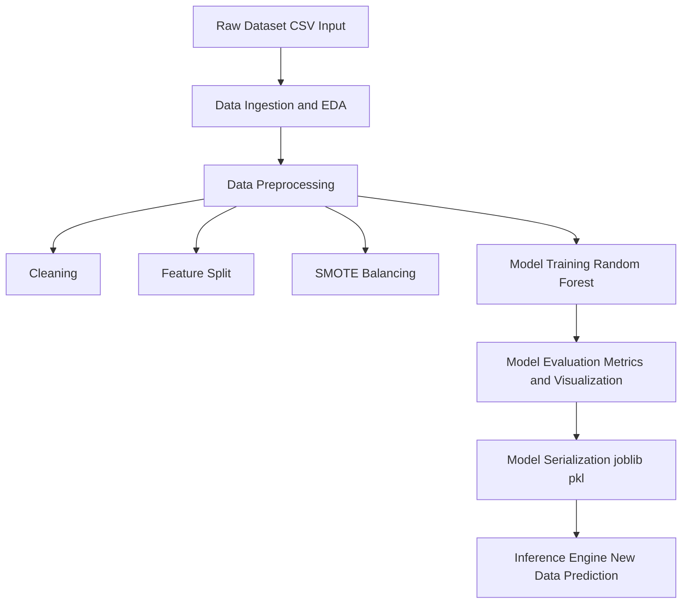
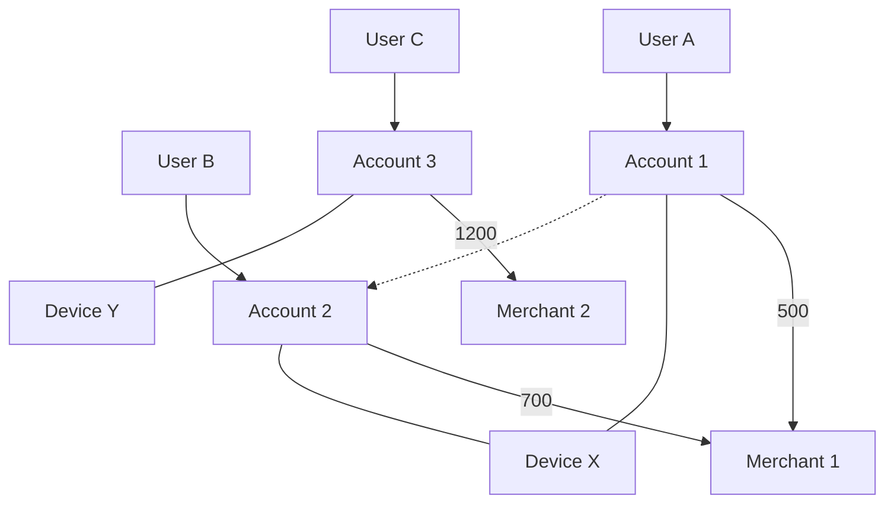

# 🏦 Advanced Deep Learning for Real-Time Fraud Detection in Banking

### 🔐 Revolutionizing Financial Security with AI

**TTEH LAB · School of Engineering, Dayananda Sagar University**  
*Bangalore – 562112, Karnataka, India*

 

  

### 📌 Prototype Implementation of:

**"Advanced Deep Learning for Real-Time Fraud Detection in Banking"**

 

### 📄 ICICI-2025, IEEE Xplore  
**DOI:** https://doi.org/10.1109/INCET64471.2025.11139964

---

# 🔭Overview

This project presents an AI-driven fraud detection system that uses graph-based modeling and deep learning to identify fraudulent financial transactions more effectively than traditional approaches. Instead of analyzing transactions individually, the system represents users and transactions as a connected graph, enabling it to capture hidden relationships and complex fraud patterns. By leveraging Graph Neural Networks (GCN) along with attention mechanisms, the model learns both local and global interaction patterns within the data. The system is trained using a hybrid loss function to improve accuracy and robustness, and it generates real-time fraud predictions evaluated using metrics such as precision, recall, and F1-score. Overall, the approach enhances detection performance, scalability, and adaptability for modern digital payment systems.

 

 ## 📚 Table of Contents

1. Introduction  
2. Mathematical Modeling & Core Equations
3. Methodology & Key Components  
4. System Architecture  
5. Model Design  
6. Tech Stack  
7. Results & Analysis  
8. Conclusion  
9. Contributors & Details  
10. IEEE Paper

<h1 align="left">💡 Problem Overview & Solution Goals</h1>
 
### Problem Statement
The banking industry faces increasingly sophisticated fraud, causing significant financial losses and reducing customer trust. Traditional rule-based and statistical systems are often reactive, struggle to adapt to evolving fraud patterns, and generate high false positives, disrupting legitimate transactions. The scale and speed of modern financial data demand a more intelligent, real-time fraud detection approach.

### Project Goal
The goal of this project is to develop an **advanced deep learning framework for real-time fraud detection** that improves accuracy and efficiency using modern AI techniques. The system aims to:

- **Minimize Financial Losses** through precise fraud detection  
- **Improve Detection Speed** with real-time analysis  
- **Reduce False Positives** to avoid disrupting genuine users  
- **Enhance Adaptability** to evolving fraud patterns  
- **Leverage Advanced Models** such as RNNs/Transformers, GNNs, and anomaly detection techniques  

 

`Fraud Detection` · `Deep Learning` · `Real-Time Systems` · `Banking Security` · `AI Models`

---

<h1 align="left">📐 Mathematical Modeling & Core Equations</h1>

### 🔹 Graph Representation

$$
G = (V, E)
$$

➡️ **Purpose:** Model transactions as a network  
➡️ **Used in:** Capturing relationships between users/accounts  

---

### 🔹 GCN Layer

$$
H^{(l+1)} = \sigma \left( D^{-1/2} A D^{-1/2} H^{(l)} W^{(l)} \right)
$$

➡️ **Purpose:** Learn features from connected nodes  
➡️ **Used in:** Detecting suspicious patterns in transaction graphs  

---

### 🔹 Self-Attention

$$
Attention(Q,K,V)=softmax\left(\frac{QK^T}{\sqrt{d_k}}\right)V
$$

➡️ **Purpose:** Focus on important interactions  
➡️ **Used in:** Capturing global dependencies in data  

---

### 🔹 Prediction Layer

$$
y = softmax(WZ + b)
$$

➡️ **Purpose:** Classify transaction (fraud / non-fraud)  
➡️ **Used in:** Final decision output  

---

### 🔹 Loss + Optimization

$$
L = L_{CE} + \lambda_1 L_{graph} + \lambda_2 L_{adv}
$$

$$
\theta = \theta - \eta \nabla L
$$

➡️ **Purpose:** Minimize error & improve model robustness  
➡️ **Used in:** Training phase  

---

### 🔹 Evaluation Metric

$$
F1 = 2 \cdot \frac{Precision \cdot Recall}{Precision + Recall}
$$

➡️ **Purpose:** Balance precision & recall  
➡️ **Used in:** Measuring fraud detection performance  

<h1 align="left"> 🔄  Methodology & Key Components </h1>

### ⚙️ Methodology
- **Data Collection:** Transaction dataset (CSV with fraud & legitimate cases)  
- **Preprocessing:** Cleaning, feature selection, normalization  
- **Imbalance Handling:** SMOTE applied to balance fraud class  
- **EDA:** Pattern analysis & visualization  
- **Model Development:** Hybrid model (GNN + Transformer)  
- **Adversarial Training:** Improves robustness against attacks/noise  
- **Evaluation:** Accuracy, Precision, Recall, F1-score, ROC-AUC  
- **Security:** Zero Trust principles for secure predictions  

---

### 🧩 Key Components
- **Data Layer:** Input dataset & preprocessing  
- **Processing Layer:** Cleaning + SMOTE balancing  
- **Model Layer:** GNN (relationships) + Transformer (sequences)  
- **Training Layer:** Adversarial learning & optimization  
- **Evaluation Layer:** Metrics & performance analysis  
- **Security Layer:** Zero Trust validation  
- **Output Layer:** Fraud detection results & insights  

---

<h1 align="left">📌  System Architecture </h1>

---

## 🔗 Transaction Graph Visualization

<h1 align="left"> 🤖 Model Design </h1>

- Hybrid deep learning architecture combining  
  **Graph Neural Networks (GNN)** + **Transformer Models**

- **GNN Layer**
  - Captures relationships between entities (graph-structured data)
  - Learns connectivity patterns and hidden dependencies

- **Transformer Layer**
  - Processes sequential data (logs / events)
  - Captures long-range dependencies using attention mechanism

- **Feature Fusion**
  - Outputs from GNN and Transformer are combined
  - Creates a richer, context-aware representation

- **Adversarial Training**
  - Introduces perturbed inputs during training
  - Improves robustness against attacks and noise

- **Output Layer**
  - Classification / prediction (e.g., anomaly detection)

---

### 🔄 Workflow
**Input Data → Preprocessing → GNN → Transformer → Fusion → Prediction**

---

<h1 align="left"> 🧪  Tech Stack </h1>

| Layer                | Technologies                          |
|---------------------|--------------------------------------|
| Language            | Python                               |
| Data Processing     | Pandas, NumPy                        |
| Imbalance Handling  | SMOTE                                |
| ML Models           | GNN, Transformers                    |
| Frameworks          | PyTorch / TensorFlow                 |
| Security            | Zero Trust Architecture              |
| Visualization       | Matplotlib, Seaborn                  |
| Tools               | Jupyter, GitHub                      |

- Built using **Python**, enabling seamless integration of data processing, machine learning, and deep learning components.  
- Efficient data handling achieved with **Pandas** and **NumPy** for preprocessing and transformation.  
- Addressed class imbalance using **SMOTE**, improving model fairness and performance.  
- Leveraged **Graph Neural Networks (GNN)** and **Transformer models** for capturing complex relationships and sequential patterns.  
- Implemented using powerful frameworks like **PyTorch / TensorFlow** for scalable deep learning.  
- Designed with a **Zero Trust Architecture**, enhancing system security and resilience.  
- Data insights and results visualized using **Matplotlib** and **Seaborn**.  
- Developed and managed using **Google Colab** and version-controlled via **GitHub**.

---

<h1 align="left"> 📊  Results & Analysis </h1>

| Metric / Finding | Value / Result | Analysis & Implications |
| :--- | :--- | :--- |
| **Initial Class Distribution** | **Legitimate (0):** 150,337 **Fraudulent (1):** 294 | 🚨 **Severe Imbalance:** The dataset is highly skewed, causing models to favor the majority class and overlook fraud cases. |
| **Overall Accuracy** | **99.95%** | ⚠️ **Accuracy Paradox:** Despite being high, accuracy is misleading due to imbalance. Even a naive model could achieve similar results. |
| **Precision (Fraud Class)** | **0.96 (96%)** | ✅ **High Confidence:** Fraud predictions are highly reliable, minimizing inconvenience to legitimate users. |
| **Recall (Fraud Class)** | **0.80 (80%)** | ❗ **Critical Weakness:** 20% of fraud cases are missed, leading to potential financial losses. |
| **F1-Score (Fraud Class)** | **0.87 (87%)** | ⚖️ **Balanced Performance:** Indicates decent trade-off, but affected by lower recall. |
| **ROC-AUC Score** | **~0.898** | 📈 **Strong Discrimination:** Good ability to distinguish classes, but not optimal for high-security systems. |
| **Confusion Matrix Breakdown** | **TN:** 30,061 **FP:** 2 **FN:** 13 **TP:** 51 | 🔍 **Conservative Model Behavior:** Minimizes false alarms but allows some fraud cases to go undetected. |
| **Pipeline Optimization Applied** | **SMOTE Integration** | 🔧 **Improvement Strategy:** Balances dataset by generating synthetic fraud samples, enhancing recall and detection capability. |

---

### 🔍 Key Takeaways
- Model prioritizes **precision over recall**, ensuring fewer false alerts  
- **Class imbalance** significantly impacts performance metrics  
- **SMOTE improves minority class detection**, but further tuning is needed  
- Trade-off exists between **security (recall)** and **user experience (precision)** 

---

<h1 align="left"> 🏁  Conclusion </h1>

### **Summary of Findings**
- The hybrid model combining **GNN and Transformer architectures** achieved high overall accuracy (~99.95%)  
- Strong **precision (96%)** indicates reliable fraud detection with minimal false alarms  
- However, **recall (80%)** reveals that some fraud cases remain undetected  
- Severe class imbalance significantly influenced model behavior and evaluation metrics  

### **Impact and Significance**
- The model is effective in **minimizing false positives**, ensuring better user experience  
- Missed fraud cases highlight a **critical risk in real-world financial systems**  
- Demonstrates the importance of using **appropriate metrics (Precision, Recall, F1)** instead of relying solely on accuracy  
- Integration of **SMOTE and adversarial training** improves robustness and fairness  

### **Next Steps**
- Improve **recall** through hyperparameter tuning and advanced sampling techniques  
- Experiment with **ensemble or more advanced deep learning models**  
- Optimize the system for **real-time deployment and scalability**  
- Further strengthen the **security layer with advanced zero-trust and quantum-resilient mechanisms**  

---

<h1 align="left"> 👥 Contributors & Details </h1>
<table>
<tr>
<td align="center">
<b>Harshitha B R</b> 
ENG23CY0018 
<a href="mailto:harshisuma1805@gmail.com">harshisuma1805@gmail.com</a>
</td>

<td align="center">
<b>Pragna G</b> 
ENG23CY0031 
<a href="mailto:pragna122004@gmail.com">pragna122004@gmail.com</a>
</td>

<td align="center">
<b>Akshata</b> 
ENG23CY0003 
<a href="mailto:tattiakshata@gmail.com">tattiakshata@gmail.com</a>
</td>

<td align="center">
<b>Sunay N</b> 
ENG23CY0039 
<a href="mailto:Rajsunay1@gmail.com">Rajsunay1@gmail.com</a>
</td>

<td align="center">
<b>Druthu Katna</b> 
ENG23CY0014 
<a href="mailto:druthukatna51@gmail.com">druthukatna51@gmail.com</a>
</td>
</tr>
</table>

---

### 🏫 Department  
**Department of Computer Science and Engineering (Cyber Security)**  
School of Engineering, Dayananda Sagar University  

---

## 🧑‍🏫 Mentor
**Dr. Prajwalasimha S N**  
_Ph.D., Postdoc. (NewRIIS)_  
Associate Professor  

Department of Computer Science and Engineering (Cyber Security)  
School of Engineering, Dayananda Sagar University  

---

## 🔬 Laboratory

**TTEH LAB**  
School of Engineering  
Dayananda Sagar University  

📍 Bangalore – 562112, Karnataka, India  

---

## 📄 IEEE Paper

**DOI:** https://doi.org/10.1109/INCET64471.2025.11139964

